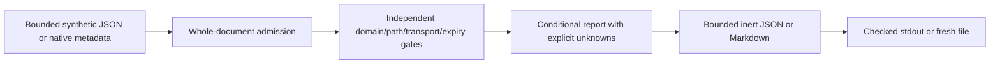

# Cookie Scoping Policy Lab

An offline Python teaching model for normalized stored-cookie scope. Compare
host-only/domain, path, secure-transport and explicit-clock expiry checks using
invented metadata. Conditional eligibility never proves browser delivery or
authentication. The application has no model, browser, cookie-jar or network dependency.

## Run

Python3.13 or newer; standard library only. From the repository root:

```sh
python -m cookielab fixtures/cases.json
python -m cookielab fixtures/cases.json --format markdown --output demo.md
python -m unittest discover -s tests -v
python -O -m unittest discover -s tests -v
```

The full demonstration exits2 because some contexts are explicitly unsupported.
Exit0 means every row fits the profile, including known scope mismatches; exit1
means invalid input or delivery failure. Existing output files are never overwritten.
See [the frozen full demonstration](fixtures/expected.md) and [JSON](fixtures/expected.json).

| Example | Domain gate | Other context | Result |
|---|---|---|---|
| Domain `example.test`, request `shop.example.test` | PASS | All gates pass | ELIGIBLE_UNDER_ASSUMPTIONS |
| Host-only `example.test`, request `shop.example.test` | FAIL | Complete | NOT_ELIGIBLE |
| Cookie path `/app`, request path `/apple` | PASS | Path FAIL | NOT_ELIGIBLE |
| Domain mismatch and missing clock | FAIL | Expiry UNKNOWN | NOT_ELIGIBLE, UNSUPPORTED |

## Architecture



Public library: `parse(bytes)` performs bounded JSON decoding; `evaluate(document)`
performs strict whole-schema admission and returns a detached report;
`render(document, format_name)` validates and returns complete report bytes. Neither
parse alone nor an eligibility result authorizes an action. Internal encoders accept
only trusted evaluated records. [PLAN.md](PLAN.md) and [CONTRACT.md](docs/CONTRACT.md)
define exact fields, statuses, diagnostics, limits and oracle provenance.

40 records maximum,64KiB input,512KiB final output,8 container levels and5000 nodes;
bounded native types, strings and integer tokens. No callback-capable objects,
generators, subclasses, floats, duplicate JSON keys, controls or surrogate code points.
No silent truncation. These are application bounds, not hard process RSS/time limits.

## Scope and security

Stored admission/retention is assumed. Use lowercase synthetic `.test` hosts and
declared absolute paths; no URL parsing or normalization. Host-only needs equality;
domain scope needs equality or a dot-boundary suffix. Path scope uses slash-boundary
comparison. Persistent expiry is `expires_at <= now` on supplied integer time.
Session lifetime remains unverified. Setting/default-path computation, PSL admission,
IDNA/IP, SameSite/site computation, partitioning and browser policy are outside v1.
Requesting excluded features cannot become eligible; known failures remain visible
beside unknowns. Same-origin is never substituted for same-site.

No actual cookie names/values, jars, headers, credentials, session storage, requests,
network service, collection or authentication verdict. Paths supplied to the CLI are
trusted operator file choices. Fresh-file writes avoid clobbering; there is no hostile
filesystem-race, durability or atomic-stdout guarantee. [SECURITY.md](SECURITY.md)
records trust boundaries and residual risks.

## Reproduce verification

Install version-pinned optional scanner dependencies only if you want SAST.
The hash lock could not be completed because official PyPI metadata access failed:

```sh
python -m pip install --only-binary=:all: -r requirements-dev.txt
python -B tools/verify.py --output reports/my-run
```

Choose a fresh descendant output directory each time. The verifier retains normal/
optimized/restored tests, all five isolated mutants, live pipe-barrier checks,
admitted stress sizes, scoped Bandit JSON and source hashes. It never regenerates
expected fixtures or modifies the production model. See [VERIFICATION.md](VERIFICATION.md)
for measured results and limits. `tools/freeze_oracles.py` is preserved one-shot
pre-core evidence; do not rerun it to replace expected outputs.

## Sources and learning

[Research comparison](docs/RESEARCH.md), [decisions](DECISIONS.md),
[learning notes](LEARNING.md), [ECC self-review](REVIEW.md) and
[attribution](ATTRIBUTION.md). RFC6265 is the narrow reference; the current HTTPWG
draft is work in progress and does not turn this lab into a browser conformance tool.

MIT licensed. AI assistance: Codex researched, implemented, reviewed and tested the
project with human scope/approval. A local draft attempt failed connection; one
verified-free public README worker returned no text. Neither supplied accepted code.
Small synthetic checks do not establish production security or independent audit.
